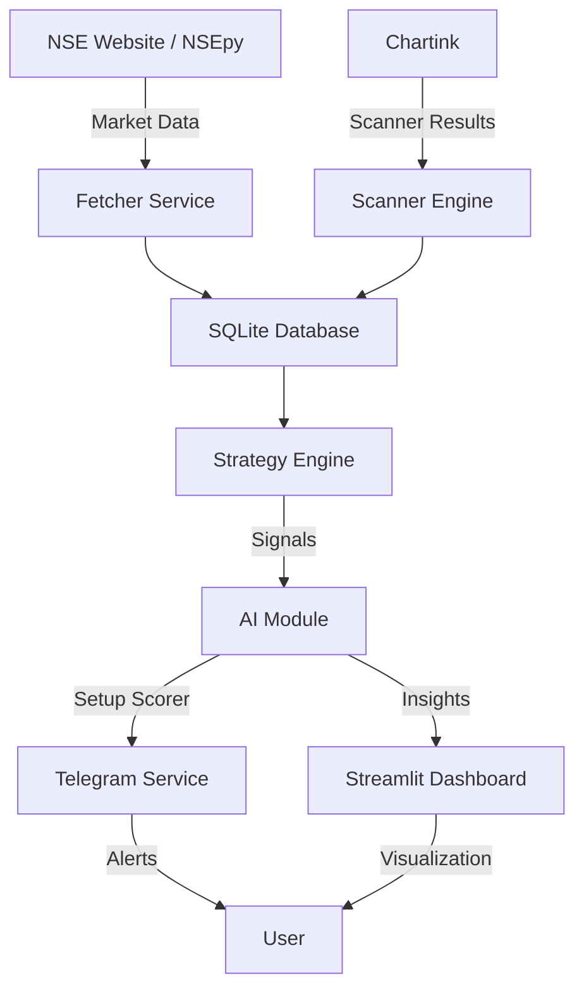

# System Architecture - Trade With Nilay (TWN)

This document provides technical details on the system architecture, database schema, and API structure.

---

## 🏗️ Architecture Overview

The system follows a modular architecture designed for high availability and low latency in Indian market conditions.

---

## 📊 Database Schema

The system uses SQLite for its high performance and zero-configuration requirements.

### Table: `minute_data`
Stores 1-minute OHLCV data for all NSE stocks.
| Column | Type | Description |
|--------|------|-------------|
| `symbol` | TEXT | NSE Symbol (e.g., RELIANCE.NS) |
| `ts` | INTEGER | Unix Timestamp |
| `open` | REAL | Opening Price |
| `high` | REAL | High Price |
| `low` | REAL | Low Price |
| `close` | REAL | Closing Price |
| `volume`| INTEGER | Traded Volume |

### Table: `scanner_results`
Stores historical hits from Chartink scanners.
| Column | Type | Description |
|--------|------|-------------|
| `scanner_name` | TEXT | Internal ID of the scanner |
| `symbol` | TEXT | Stock symbol |
| `price` | REAL | Price at alert time |
| `pct_change` | REAL | % Change at alert time |
| `ts` | INTEGER | Alert timestamp |

---

## 🔗 API Structure (Internal/Frontend)

The Streamlit dashboard communicates with the backend utilities via direct function calls and database queries.

### Data Fetching
- `services.fetcher_v2.MultiSourceFetcher`: Retrieves live prices.
- `services.symbol_manager.SymbolManager`: Manages the universe of 2600+ stocks.

### Strategy & Patterns
- `strategy.smc.find_order_blocks()`: Identifies supply/demand zones.
- `strategy.patterns.detect_box_pattern()`: Identifies consolidation ranges.

---

## ☁️ Cloud Workflow

1. **GitHub Actions Trigger**: Every 5 minutes during market hours.
2. **Setup**: Installs Python dependencies.
3. **Execution**: Runs `python -m backend.scheduler --once`.
4. **Persistence**: Commits updated `.db` file and logs back to the private repo.

---

## 🛠️ Error Handling & Self-Healing

- **Backoff Logic**: If NSEpy fails, the fetcher waits and retries.
- **Failover**: Switches to backup data sources if the primary is down.
- **Auto-Recovery**: GitHub Actions clean environment on every run ensures no stale state.
