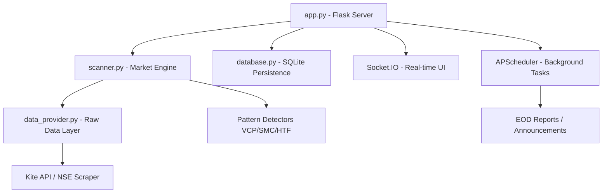

# 📋 Trade with Nilay – Project Blueprint & Handover

This document serves as the **Full Project Source of Truth**. Any AI or developer can use this blueprint to understand the entire architecture and continue development without losing progress.

---

## 🏗️ 1. Project Architecture

The system is a **Real-Time Institutional-Grade Stock Scanner** built with Python (Flask) and a modern WebSocket-driven frontend.



---

## 📁 2. File Map & Feature Responsibility

| File | Purpose | Feature / Functionality |
| :--- | :--- | :--- |
| **`app.py`** | Main entry point | Routes, WebSockets, Job Scheduling, API Endpoints. |
| **`scanner.py`** | Core Scan Logic | Multi-threaded NSE scanning, Alert generation, Result filtering. |
| **`database.py`** | DB Manager | SQLite schema, WAL mode, Render persistent disk support. |
| **`data_provider.py`** | Data Abstraction | Fetches quotes and history from various sources (NSE, Kite). |
| **`kite_provider.py`** | Kite API Wrapper | Specialized logic for Zerodha Kite Connect integration. |
| **`ai_reports.py`** | AI Analysis | Uses Gemini/AI to generate stock fundamental summaries. |
| **`indicators.py`** | Math Engine | RS Rating (vs Nifty), EMA, RSI, WMA calculations. |
| **`telegram_bot.py`** | Alerting System | Formats and sends professional Telegram signals. |
| **`backend/strategy/`** | Institutional Logic | VCP detection, Order Blocks (SMC), Box breakouts. |
| **`templates/`** | UI Layouts | `base.html` (structure), `index.html` (dashboard/tabs). |
| **`static/js/main.js`** | Frontend Logic | Real-time updates, tab management, AI report modals. |

---

## ✅ 3. Current Implementation Status

### 🟢 Fully Functional
- **Lightning Scan**: Scans 2600+ NSE stocks in parallel (~30-60s).
- **Institutional Patterns**: VCP (Volatility Contraction), HTF (High Tight Flag), SMC (Order Blocks).
- **RS Rating**: Relative Strength vs Nifty 50 (95+ score identification).
- **Telegram Alerts**: Richly formatted alerts with TradingView links and targets.
- **Corporate Announcements**: Integrated news feed with importance detection.

### 🟡 Partially Implemented / Needs Polish
- **UI Aesthetics**: Currently being overhauled to "Premium" status.
- **Backtesting**: 1-year historical engine is functional but needs visualization.
- **Empty States**: Needs better "No Data" handling on the frontend.

### 🔴 Pending / Future
- **Auto-Trading**: Kite API buy/sell order integration.
- **Portfolio Tracking**: Live P&L monitoring from external brokers.

---

## 🛠️ 4. Technical Specs & APIs

- **Backend**: Python 3.10+, Flask, Flask-SocketIO, APScheduler.
- **Frontend**: HTML5, Bootstrap 5, Vanilla JS, CSS3 (Glassmorphism).
- **Database**: SQLite3 (Performance optimized with WAL).
- **APIs Used**:
  - **Kite Connect (Zerodha)**: Live quotes and history.
  - **NSE India (Unofficial)**: Fallback bhavcopy and announcements.
  - **Gemini API**: AI-generated reports.
  - **Telegram Bot API**: Instant mobile alerts.

---

## 🚀 5. Setup & Launch Instructions

### Local Development
1. **Clone & Install**:
   ```bash
   pip install -r requirements.txt
   ```
2. **Environment**: Create a `.env` file with `KITE_API_KEY`, `TELEGRAM_BOT_TOKEN`, `TELEGRAM_CHAT_ID`.
3. **Initialize DB**:
   ```bash
   python database.py
   ```
4. **Run Server**:
   ```bash
   python app.py
   ```

### Render Deployment (24/7)
1. **Procfile**: Use `web: gunicorn --worker-class eventlet -w 1 app:app`.
2. **Persistent Disk**: Mount one at `/data` for the SQLite DB.
3. **Environment**: Set all keys in Render's "Environment" tab.

---

**Blueprint Version: 3.0** (Final Stable Release)
